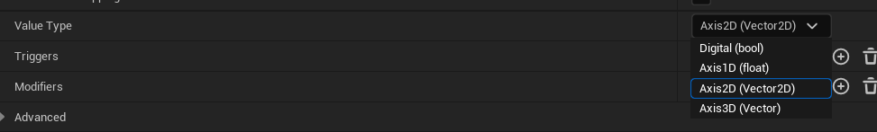
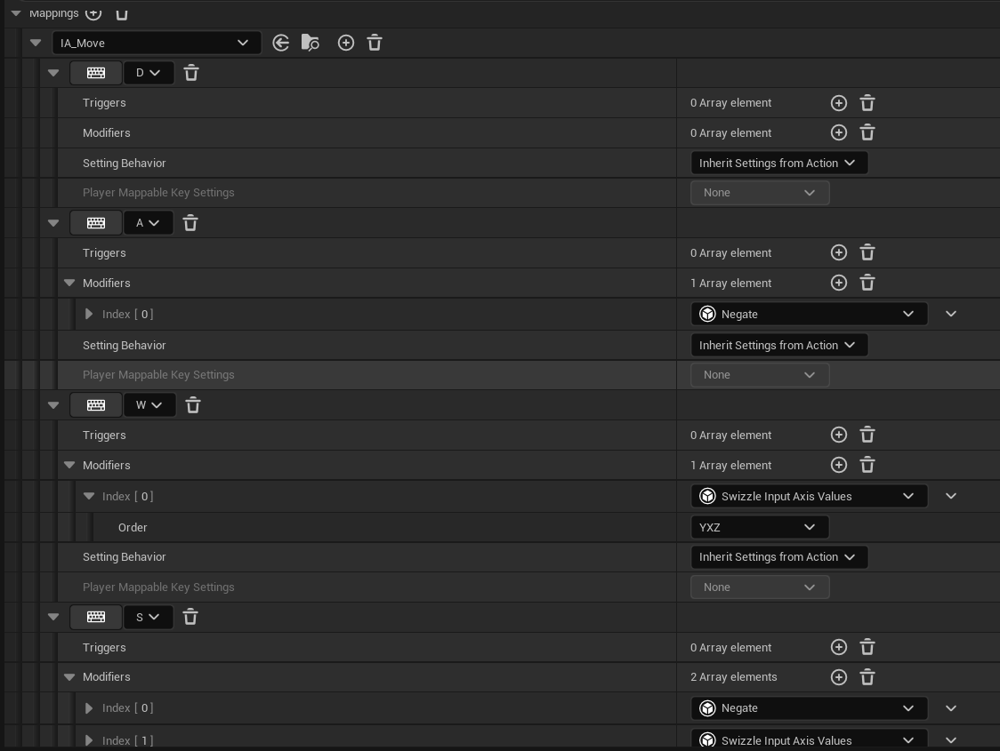

## 前言

相比于传统的输入，我们升级为增强输入，为什么使用增强输入呢？

增强输入有更灵活与更强大的输入管理，灵活体现在哪里？我们可以有不同的映射上下文，这样使用不同的映射上下文就会有不同的效果；

更强大体现在输入模式的增多等；

前向声明和模块的一起使用，可以让我们不用添加一些头文件，也可以使用类型；

## 输入配置

### InputAction



InputAction主要负责配置输入的类型，如上图，有四种输入类型，根据你的项目进行输入类型的选择；

### InputMapingContext



为IA_Move类型添加上下文，这里面用的经典的WASD,需要注意的是默认的轴是X轴，你需要Swizzle一下，来让ws产生输入；增强输入的强大就体现在这里，我们可以更具IA_Move添加其他键的输入映射，只需要在指针里切换一下，这里的就没有用了，而是使用我们更改的；

## 启用输入

在上面配置了，到底还是无法移动的，一个是没有函数处理你的输入，二是你的输入在增强系统里面还没有被启用；

因为移动是控制玩家的逻辑，既然是控制玩家，那么我们就将增强输入写在controller里面；

```
class UInputMappingContext;
class UInputAction;
struct FInputActionValue;

private:
	//
	UPROPERTY(EditAnywhere,Category="Input")
	TObjectPtr<UInputMappingContext>AuraContext;

	UPROPERTY(EditAnywhere,Category="Input")
	TObjectPtr<UInputAction>MoveAction;

	void Move(const FInputActionValue& InputActionValue);
```

在类中添加我们上面的输入配置类型的指针，毕竟我们在cpp里面配置，为了不加对应的头文件，我们在.build.cs里面添加”EnhancedInput"模块，并在类文件中对该类型进行前向声明；

输入类型都是FInputActionValue;

因为输入的配置我们希望是在游戏开始的时候，所以在controller类的BeginPlay（）函数中启用对应的映射上下文，在蓝图中对AuraContext和MoveAction赋值，只是说明有了实例，但实例是否被运行，还取决于增强子系统的接口AddMapingContext(UInputMaping,int);为什么有了实例不运行那个实例，而还要经过一层呢？是因为我们可以在类文件中还可以再添加一个UInputMapingContext类型的指针，然后实例化它。所以问题来了，执行哪一个Context?所以会有增强输入子系统来管理输入模块；

```
	UEnhancedInputLocalPlayerSubsystem* Subsystem = ULocalPlayer::GetSubsystem<UEnhancedInputLocalPlayerSubsystem>(GetLocalPlayer());
	check(Subsystem);
	Subsystem->AddMappingContext(AuraContext,0);
```

因为我们这里使用了AuraContext,所以在使用前最好check（AuraContext)一下，避免忘了蓝图中实例化导致空指针被使用；

到这里我们的输入算是启用了。在这里我加点小餐，因为鼠标和游戏模式都是在controller类里的，所以一般我们在该类的BeginPlay()函数里面也进行一些设置；

```
	//在Player中设置好鼠标和输入模式
	bShowMouseCursor = true;
	DefaultMouseCursor = EMouseCursor::Default;

	FInputModeGameAndUI InputModeData;
	InputModeData.SetLockMouseToViewportBehavior(EMouseLockMode::DoNotLock);
	InputModeData.SetHideCursorDuringCapture(false);
	SetInputMode(InputModeData);
```

## 处理输入

我们知道Actor具有处理输入的能力，这种能力被封装在SetupInputComponent()里面，而一般我们在这个函数里面要做的就是绑定输入和	处理这种输入的函数；	

```

void AAuraPlayerController::SetupInputComponent()
{
	Super::SetupInputComponent();


	//设置输入，将普通输入转换为增强输入；将输入InputAction和Move函数绑定；
	UEnhancedInputComponent* EnhancedInputComponent = CastChecked<UEnhancedInputComponent>(InputComponent);
	EnhancedInputComponent->BindAction(MoveAction, ETriggerEvent::Triggered, this, &AAuraPlayerController::Move);

}

```

因为我们前面用的全是增强输入类，那绑定肯定要让增强输入组件来绑定了，注意添加头文件“EnhancedInputComponent.h"

再做具体的处理移动的函数；

```
void AAuraPlayerController::Move(const FInputActionValue& InputActionValue)
{
	//移动的具体逻辑
	const FVector2D	InputAxisVector = InputActionValue.Get<FVector2D>();
	const FRotator Rotation = GetControlRotation();
	const FRotator YawRotation(0, Rotation.Yaw, 0);

	const FVector ForwardDirction = FRotationMatrix(YawRotation).GetUnitAxis(EAxis::X);
	const FVector RightDirction = FRotationMatrix(YawRotation).GetUnitAxis(EAxis::Y);

	if (APawn* ControlledPawn = GetPawn<APawn>())
	{
		ControlledPawn->AddMovementInput(ForwardDirction, InputAxisVector.Y);
		ControlledPawn->AddMovementInput(RightDirction, InputAxisVector.X);
	}
}
```

就这样就可以啦；
