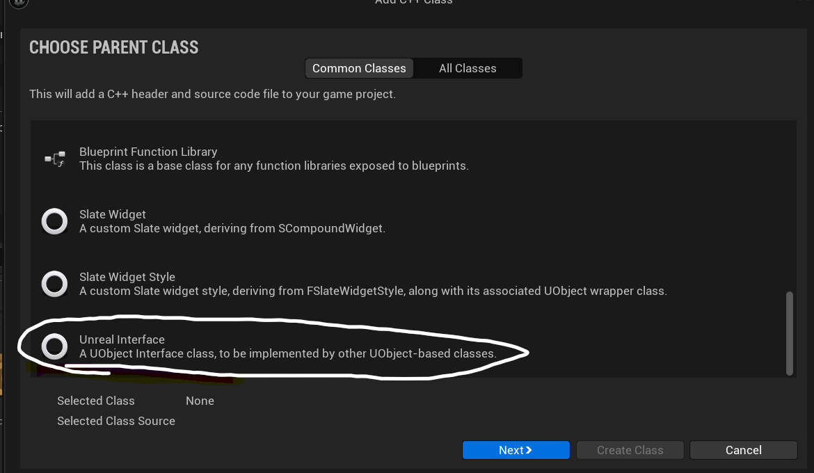

# EnemyHighLight

## 前言

当鼠标移动到敌人身上的时候，我们希望敌人高亮，反之，则不高亮；那怎么实现呢？

## 思路

我们将鼠标移到一个actor上的时候，检查该actor有没有这样一个接口，该接口可以使敌人高亮；

所以我们应该做一个Unreal Interface的类，这个类来高亮与取消高亮的纯虚函数；虚幻引擎的接口类中只能写纯虚函数，也就是定义一个接口，而不会有具体的实现；

在蓝图中，我们将接口类在actor类设置中设置好，就可以在actor类中重写虚函数，但是我们的c++却是使用了继承机制。我们希望所有的敌人都可以高亮，所以将Enemy的基类继承自这个接口类，然后就可以重写接口，做实现；

而鼠标放上去，敌人为什么能高亮，怎么高亮就由player来控制了；毕竟鼠标的控制权（鼠标的处理碰撞的返回值全在player里面）；更具GamePlay的设计逻辑，控制逻辑本来也应该写在controller里面；

## 实现

### 接口类



继承自该类的EnemyInterface类，我们不仅可以在该类里写高亮函数，还可以拓展很多功能，以实现蓝图通信之类的功能；

在该类里定义两个接口

```
	virtual void HighLightActor() = 0;
	virtual void UnHighLightActor() = 0;
```

### 继承

因为我们需要敌人高亮，所以应该让Enemy类继承，并实现它

```
class TOPDOWNGAME_API AAuraEnemy : public AAuraCharacterBase,public IEnemyInterface
{
	GENERATED_BODY()
public:
	AAuraEnemy();
	virtual void HighLightActor() override;
	virtual void UnHighLightActor() override;
};
```

在cpp中实现就可以，因为我们目前先要实现这个框架，具体的高亮则可以不用先实现，可以先用debug之类的替代一下，等到这个功能能实现，再做具体的复杂功能；

Q: 为什么要做一个接口类呢？我指针移到敌人身上，无需检查类型，直接看它是否是敌人类就可以了啊。

A: 我们这么做只是为了灵活性，如果不做接口类，那么高亮就只能依赖于敌人类，而无法在其他类上进行使用。其次我们的Controller类依附于敌人类，耦合有些深了；

### 控制

我们希望鼠标移到敌人身上敌人高亮，这肯定是对鼠标的碰撞做了逻辑，而且具体的控制逻辑本来就应该controller类来做；

我们希望鼠标的这种跟踪功能是每帧执行，因为你可能这一帧鼠标在地面上，下一帧就在Enemy上面，所以我们希望这个函数可以在Tick函数里面执行

```
//在Controller.h中
protected:
	virtural void PlayTick(float DeltaTime) override;
private:
	void CursorTrace ();
	IEnemyInterface *LastActor;
	IEnemyInterface *ThisActor; //注意添加"EnemyInterface.h"头文件，否则报错，未识别标识符；
```

```
//在Controller.cpp中
 	virtual void AAuarController::PlayTick(float DeltaTime) override
	{
		Super::PlayTick(DeltaTime);
		CursorTrace();
	}
	void AAuraController::CursorTrace()
	{
	FHitResult CursorHit;//顾名思义，到发生了碰撞后的一些返回值就存放在CursorHit里面
	GetHitResultUnderCursor(ECC_Visibility, false, CursorHit);
	if (!CursorHit.bBlockingHit) return;

	LastActor = ThisActor;
	ThisActor=Cast<IEnemyInterface>(CursorHit.GetActor());//类型转换，看看能否将actor转换为接口类，能的话说明该actor应该高亮；

	/*
	* line trace from cursor,There are several scenarios;
	* A. lastactor is null && thisactor is null
	*		-Do nothing;
	* B. lastcator is null && thisactor is valid
	*		-HightThisActor
	* C. LastActor is valid && ThisActor is null
	*		-UnHightThisActor
	* D. BothActor is valid but ThisActor != LastActor
	*		UnHightLastActor && HightThisActor
	* E. BothActor is valid && are the same actor
	*		-Do nothing
	*/
	if (LastActor == nullptr) {
		if (ThisActor != nullptr) {
			//case B;
			ThisActor->HighLightActor();
		}
		else {
			//case A;
		}

	}
	else {
		if (ThisActor == nullptr) {
			//case c;
			LastActor->UnHighLightActor();
		}
		else {
			if (ThisActor != LastActor) {
				LastActor->UnHighLightActor();
				ThisActor->HighLightActor();
			}
			else {
				//Case E;
			}
		}
	}
	}
```

做到这一步就可以了，我们就可以做一个调式，看该逻辑能否实现，一般轮廓一类的，都用Draw Debug Sphere之类 来做调试；

做完调试发现该逻辑没有问题，那么就实现具体的功能；

## post process Volume

用这个东西来实现我们具体的高亮与否；

在level中拖入post process volume,然后在Details里将 infinite extent设置为true

在post process materials里面设置对应的材质，你希望高亮的颜色是什么之类的，怎么样显示轮廓之类；

在Project Settings里面的 postprocessing下面打开Enabled with stencil.若只是打开Enabled会发现轮廓不是很清晰；

做完这两部就可以在Enemy类里面进行对mesh的设置来让他们高亮了；

```
void AAuraEnemy::HighLightActor()
{
	GetMesh()->SetRenderCustomDepth(true);
	GetMesh()->SetCustomDepthStencilValue(CUSTOM_DEPTH_RED);//这个函数一般都是用来轮廓描边和高亮显示的；
	Weapon->SetRenderCustomDepth(true);
	Weapon->SetCustomDepthStencilValue(CUSTOM_DEPTH_RED);
}

void AAuraEnemy::UnHighLightActor()
{
	GetMesh()->SetRenderCustomDepth(false);
	Weapon->SetRenderCustomDepth(false);

}
```

因为我们在做碰撞时的逻辑是，鼠标在visibility通道上，对block做出反应

```
	FHitResult CursorHit;
	GetHitResultUnderCursor(ECC_Visibility, false, CursorHit);
	if (!CursorHit.bBlockingHit) return;
```

所以我们敌人类的mesh的碰撞也应该设置为这类，所以在敌人类里，做一个构造函数，让碰撞变为我们想要做出反应的

```
AAuraEnemy::AAuraEnemy()
{
	GetMesh()->SetCollisionResponseToChannel(ECC_Visibility, ECR_Block);
}
```

就这样，我们的任务完成；
