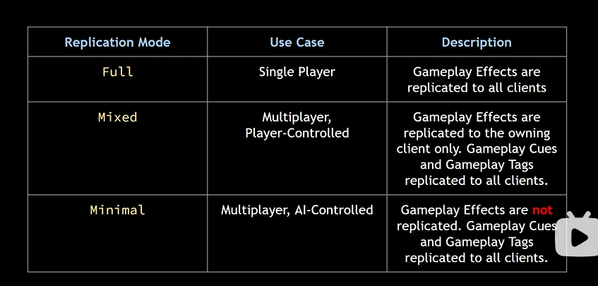

## 前言

我们知道，ASC和AS应该适用于每一个Character,有这样一种情景，当我们操作的角色死亡后我们重新生成的角色可以继承前一个角色的属性和能力，而非又进行一遍初始化，所以这个用于角色的ASC和AS应该放在playerstate上面。对于敌人来所，我们没有继承这种属性和能力的需要，所以可以直接写在敌人类里面；

## 代码

### Enemy

先说说写在敌人身上的Asc和AS，按理来说应该可以直接写在Enemy类上面，但是为了更好的灵活性，也就是万一我们以后可能还会增加其他类型的Character,这种Character也需要这两个组件，所以我们将它写在Charater的基类上面；

接下来在Enemy.cpp中实现就可以了；

注意的是我们需要将AbilitySystemComponent设置为replicated;

### Character

根据前言，我们将在上面的为Enemy所作的复制一边到playerstate.h 和 .cpp就可以；

### IAbilitySystemInterface

用上述的两个类来继承它，然后覆写虚函数；

它的作用是获取AbilitySystemComponent和AttributeSet的实例；

## ReplicationMode

为ASC设置复制模式；

AbilitySystemComponent->SetReplicationMode(EGamePlayEffectReplicationMode::Enum);

根据不同的Case，执行不同的Mode,这一切都是有ASC的情况下；
