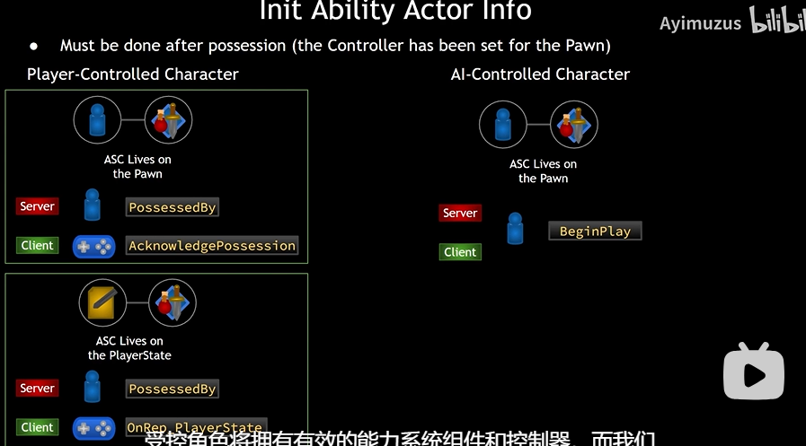

## 前言

现在我们将ASC放入了两个类，我们知道的是敌人类中的ASC和AS被初始化了，但是AuraCharacter也有这两个指针，但并没有被初始化。同样，因为ASC直接挂在敌人身上，也就是它的一些属性可以直接在身上表示出来，也可以被自己直接更新（因为敌人的属性一般是固定的，所以它并没有像用于我们的角色的ASC挂在PlayerState上面）。而我们角色的属性和能力挂在PlayerState上面，我们怎样在游戏中表示出角色的属性呢？ASC提供了一个函数，让ASC知道谁是实际的控制者，谁是效果的表现者；InitAbilityActorInfo(Owner,Avatar);

## 代码

在哪里调用这个函数，在什么时候调用这个函数呢？遵循下图的原则；

1. 先来谈谈最简单的敌人类，也就是上图的AI_Controlled Character

ASC此时的实际控制者和效果表示者都是这个pawn，所以我们可以在游戏开始（Begin Play）调用InitAbilityActorInfo(this,this	)来让ASC知道谁是它的主人，它寄生在谁的身上；

2. ASC 写在PlayerState上面；对于服务器来说，ASC应该在PossessedBy函数里面调用这个函数；因为PlayerState会设置controller,所以当你设置好controller的时候，我们的PlayerState也就设置好了。
   对于客户端在OnRep_PlayerState里面调用ASC,因为他要确保PlayerState是否是有效的；如果无效的化，初始化也就没有了意义；
