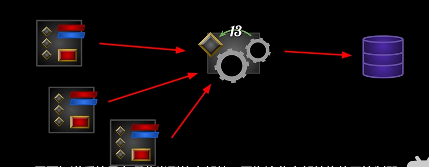

## 前言



UI基于这种MVC架构进行设计，在这种设计中，Model不需要知道Contorller，Controller不需要知道Widget，这样提高灵活性，耦合降低，我们就可以对Widget和controller进行更换，而不需要对model进行更改；

## New class

做一个UserWidget类和WigetController类

### UAuraUserWidget

对于Widget，我们需要知道WidgetController类，因为它负责将游戏中的数据传入到我们的Widget,所以我们应该有一个WidgetController的指针，设置好指针后我们希望能做出些应在Wiget里，所以设置一个蓝图实现的函数。做完这个，我们再做一个指针的赋值函数

```
	UFUNCTION(BlueprintCallable)
	void SetWidgetController(UObject* InWidgetController);

	UPROPERTY(BlueprintReadOnly)
	TObjectPtr<UObject>WidgetController;

protected:
	UFUNCTION(BlueprintImplementableEvent)
	void WidgetControllerSet();

```

在cpp中实现赋值函数

```
void UAuraUserWidget::SetWidgetController(UObject* InWidgetController)
{
	WidgetController = InWidgetController;
	WidgetControllerSet();
}

```

### UAuraWidgetController

我们希望Controller能拿到游戏中的数据，而目前我们的项目主要来源于四个模块，playerController,PlayerState,ASC,AS;

```
	UPROPERTY(BlueprintReadOnly,Category="WidgetController")
	TObjectPtr<APlayerController>PlayerController;

	UPROPERTY(BlueprintReadOnly, Category = "WidgetController")
	TObjectPtr<APlayerState>PlayerState;

	UPROPERTY(BlueprintReadOnly, Category = "WidgetController")
	TObjectPtr<UAbilitySystemComponent>AbilitySystemCOmponent;

	UPROPERTY(BlueprintReadOnly, Category = "WidgetController")
	TObjectPtr<UAttributeSet>AttributeSet;
```
