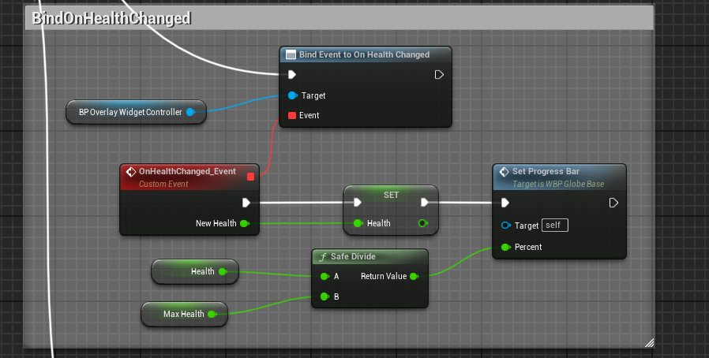
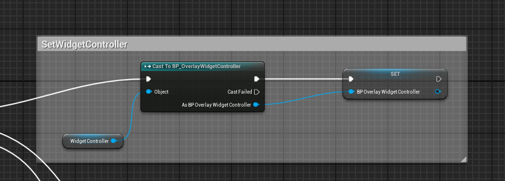
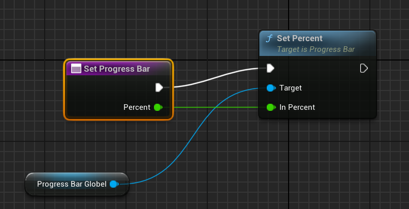

## 前言

这节课涉及到动态多播委托，我们希望controller得到数据发送到widget,但是我们不希望controller知道widget的存在，所以我们采用广播的方式，类似用设计模式的观察者模式，我们用AttributeSet的属性的初始化作练习，我们希望能将属性值与血条UI能够绑定。

## DECLARE_DYNAMIC_MULTICAST_DELEGATE

将数据广播时我们希望所有的controller都具有的功能，所以我们在Controller基类写一个虚函数用来广播数据，具体怎么广播，广播什么由子类来决定；

```
virtual void BroadCastInitialValues();
```

在继承自基类的OverlayWidgetController中我们广播overlaywiget需要的数据

对于血条我们需要Health，MaxHealth.所以我们可以用广播的形式将这两个数据发送出去，在这里采用传入一个参数的委托，用两个委托将数据传出去；

```
DECLARE_DYNAMIC_MULTICAST_DELEGATE_OneParam(FOnHealthChangedSignature, float, NewHealth);
DECLARE_DYNAMIC_MULTICAST_DELEGATE_OneParam(FOnMaxHealthChangedSignature, float, NewMaxHealth);

```

有了代理宏，我们需要声明一个代理名称

```
UPROPERTY(BlueprintAssignable, Category = "GAS|AttributeSet")
FOnHealthChangedSignature OnHealthChanged;
UPROPERTY(BlueprintAssignable, Category = "GAS|AttributeSet")
FOnMaxHealthChangedSignature OnMaxHealthChanged;
```

现在我们根据代理，将数据广播出去

```
	UAuraAttributeSet* AuraAttributeSet = CastChecked<UAuraAttributeSet>(AttributeSet);//Attribute是Controller的四个参数之一，可以直接使用

	OnHealthChanged.Broadcast(AuraAttributeSet->GetHealth());
	OnMaxHealthChanged.Broadcast(AuraAttributeSet->GetMaxHealth());
```

现在我们可能发现一个问题，有委托自然也要有委托函数来进行绑定，我们这里怎么没有委托函数呢，其实动态多播委托的绑定可以是在蓝图中的。

数据广播出去后，立马触发绑定函数，



这里需要注意一个点是，因为我们使用了BlueprintAssignable,函数的绑定要到蓝图里进行，但是我们的OverlayWidgetController还没有类型化（BlueprintType),也就是无法Cast To类型转换，所以我们就没有办法绑定函数（因为此时在BP_Widget里面，所以需要将WidgetController给cast到BP_Controller),只需要简单的在OverlayController的UCLASS（）声明BlueprintType就可以了；声明后就可以如下



到现在数据也传进来了，委托函数也做了，然后我们看具体的UI是怎么做的；



此时只需要将调用SetPercent就可以了；
