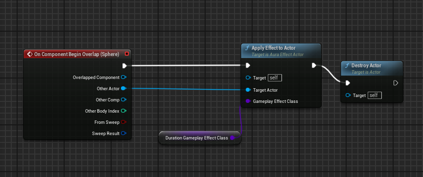

## 前言

我们通过GameplayEffect来改变我们的AttributeSet上面的属性，那具体是怎么进行改动的呢？首先我们肯定需要一个场景里能放的类，这个类有改动我们AttributeSet属性的能力，所以我们有了AuraEffectActor。我们在这里面放GameplayEffect,让它来改变属性；

## GamePlayEffectClass

由于GameplayEffect是一个类且我们希望能在蓝图里面调节，因为这真的很方便，所以我们会给EffectActor来一个TSubclassOf

```
	UPROPERTY(EditAnywhere,BlueprintReadOnly,Category="Effects")
	TSubclassOf<UGameplayEffect>InstantGameplayEffectClass;
```

然后我们想要将GameEffect应用到我们带有ASC的actor上面，所以要写一个函数，并且将GameEffect应用到Actor上面；

```
	void ApplyEffectToActor(AActor *TargetActor,TSubclassOf<UGameplayEffect>GameplayEffectClass);
```

```
void AAuraEffectActor::ApplyEffectToActor(AActor* TargetActor, TSubclassOf<UGameplayEffect> GameplayEffectClass)
{
	UAbilitySystemComponent* TargetASC=UAbilitySystemBlueprintLibrary::GetAbilitySystemComponent(TargetActor);
	if (TargetASC == nullptr) return;

	//将GamePlayEffect应用到ASC上面；
	check(GameplayEffectClass);
	FGameplayEffectContextHandle GameplayEffectContextHandle=TargetASC->MakeEffectContext();
	GameplayEffectContextHandle.AddSourceObject(this);
	FGameplayEffectSpecHandle EffectSpecHandle=TargetASC->MakeOutgoingSpec(GameplayEffectClass, 1.0f, GameplayEffectContextHandle);
	TargetASC->ApplyGameplayEffectSpecToSelf(*EffectSpecHandle.Data.Get());
}

```

这个函数什么时候触发呢，就是重叠事件了；



我们还没有设置GameplayEffectClass呢，所以会触发断言，所以我们需要做一个GameplayEffect

## GameplayEffect

我们设置一个GameplayEffect就可以了，上面就可以正常运行了，但是我们需要对GameplayEffect需要进行详细的讨论；


### Duration Policy

这个是我们对属性的改变的效果的形式，Instant就是即时的，立马就改变了，无法移除，就比如加了20的血量，那么加完之后就是不变的；

对于Has Duration,是将属性改变一段事件后复原，Infinite是永久改变，但是可以移除；

### Periodic Policy


可以看到只要应用了Periodic，那么对属性的改变就是永久的，直接改变BaseValue;

应用了这种属性，它的工作原理就是这样，每周期执行一次Modifiers,执行几个周期呢？Duration/Periodic次，值得一提的是，如果你勾选的是Instant的选项，那么就没有Periodic的选项；

### Stacking

#### Aggregate By Source


#### Aggregate By Target


更据上述的规则就可以对PlayEffect进行我们想要的工作方式；

### Infinite Policy

```
	UPROPERTY(EditAnywhere, BlueprintReadOnly, Category = "Effects")
	TSubclassOf<UGameplayEffect>InfiniteGameplayEffectClass;
```


然后在蓝图中调用函数就可以了；
