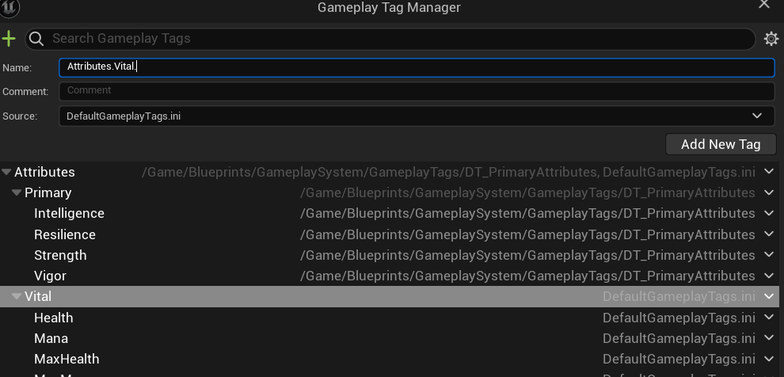
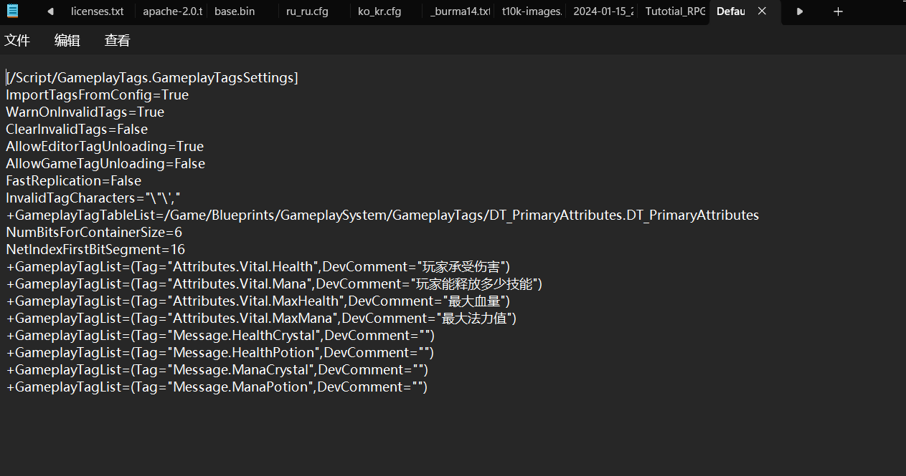
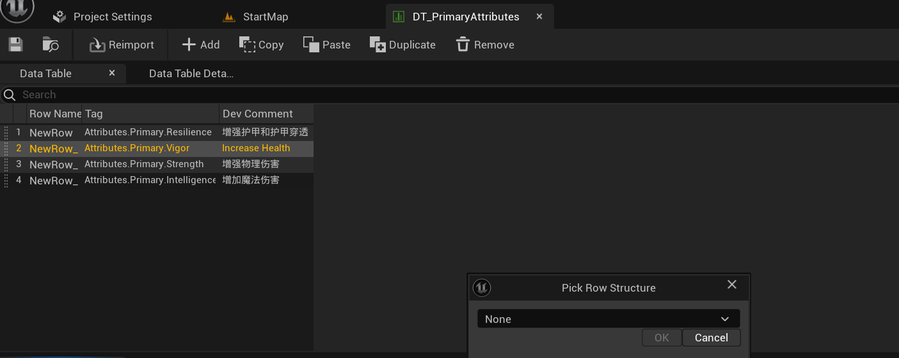
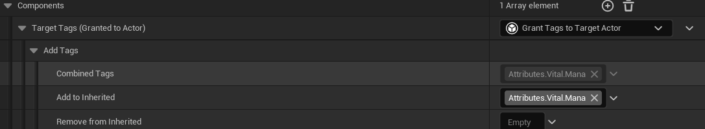
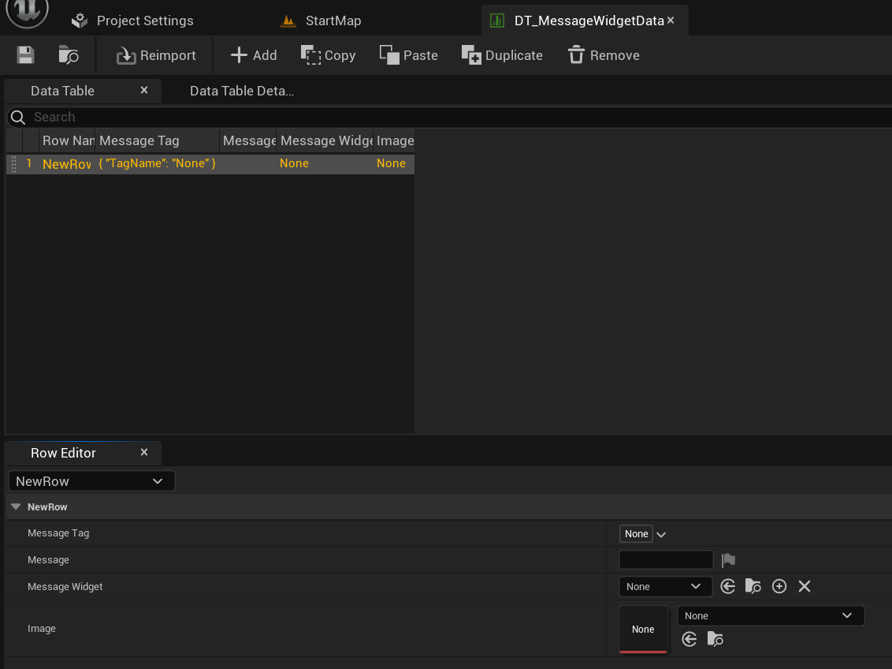
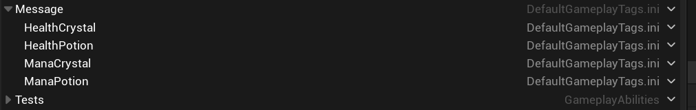
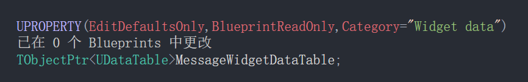
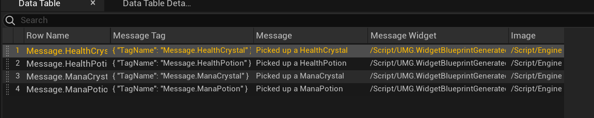
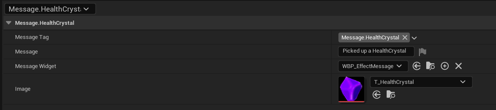
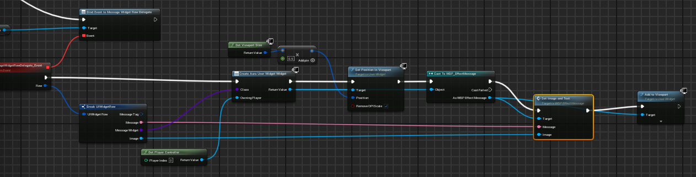

## 前言

对于GameplayTag，文档中已经写的很清楚，我们不多赘述。直接看我们项目中的使用

## 创建Tag

有三种创建GameplayTag的方式。

### Editor

通过层级标签进行创建，如下图；



### .ini文件中进行修改



### Data Table



## ApplyTagToASC

### Grant Tags to Target Actor方式



通过这种方式可将Tag从GE放到ASC上;但注意这种Grant Tags to Target Actor的方式不适用于Insistant的GE;

### AssetTag

这种方式下的Tag只能挂在GE自己的身上，而不能赋予给别人；

## ASC的委托

```
/** Called on server whenever a GE is applied to self. This includes instant and duration based GEs. */
FOnGameplayEffectAppliedDelegate OnGameplayEffectAppliedDelegateToSelf;
```

```
DECLARE_MULTICAST_DELEGATE_ThreeParams(FOnGameplayEffectAppliedDelegate, UAbilitySystemComponent*, const FGameplayEffectSpec&, FActiveGameplayEffectHandle);
```

这两段代码是在ASC中的委托，注释说的很清楚，当应用到Self的时候该委托被调用；

现在我们给这个委托做一个绑定；

```
void UAuraAbilitySystemComponent::AbilityActorInfoSet()
{
	OnGameplayEffectAppliedDelegateToSelf.AddUObject(this, &UAuraAbilitySystemComponent::EffectApplied);
}

void UAuraAbilitySystemComponent::EffectApplied(UAbilitySystemComponent* ASC, const FGameplayEffectSpec& EffectSpec, FActiveGameplayEffectHandle ActiveEffectHandle)
{
	FGameplayTagContainer TagContainer;
	EffectSpec.GetAllAssetTags(TagContainer);

	EffectAssetTags.Broadcast(TagContainer);


}
```

可以看到我们自己也做了一个委托；

```
UAuraASC.h
DECLARE_MULTICAST_DELEGATE_OneParam(FEffectAssetTags, const FGameplayTagContainer&);
FEffectAssetTags EffectAssetTags;

UAuraASC.cpp
EffectAssetTags.Broadcast(TagContainer);

OverlayWidgetController.cpp
Cast<UAuraAbilitySystemComponent>(AbilitySystemComponent)->EffectAssetTags.AddLambda(
	[](const FGameplayTagContainer& AssetTags)
	{
		for (const FGameplayTag& Tag : AssetTags) {
			FName Msg = Tag.GetTagName();
			GEngine->AddOnScreenDebugMessage(-1, 6, FColor::Blue, Msg.ToString());
		}
	}
```

到这里我们可以看到我们先是用了一个ASC原本就有的委托，然后我们在这个委托里调用了我们自己定义的委托；我们做这个的目的何在呢？

首先，第一个委托是ASC封装好的，我们只是绑定一个函数，当GE apply到Self上的时候他就会自动调用这个委托，当这个委托被调用，它传进来三个参数，我们从EffectSpec里面拿到在GE里定义好的AssetTag，并放到FGameplayTagContainer容器里面；

我们定义的委托是传一个参数的委托，将上面的容器发送出去；

可以从代码中看到OverlayWidgetController接收了TagContainer;并做出了相应的逻辑；

### ASC委托总结

上面就是通过两个委托，将GE上的Tag发送出去，然后被Controller接受到的模型，通过这个模型，我们可以将一些数据在GE apply时，将它从ASC发送；

## UI Widget DataTable

在上面，我们只是将Tag的Name发送到Controller,现在我们希望做更有趣的东西，就是使用Tag并做一些事情并进行广播；

现在我们做这样一种事，就是通过Tag检索一些消息，并发送出去；

1. 首先定义一种结构体

```
overlaywidgetcontroller.h

USTRUCT(BlueprintType)
struct FUIWidgetRow :public FTableRowBase
{
	GENERATED_BODY()

	UPROPERTY(EditAnywhere,BlueprintReadOnly)
	FGameplayTag MessageTag = FGameplayTag();

	UPROPERTY(EditAnywhere,BlueprintReadOnly)
	FText Message = FText();

	UPROPERTY(EditAnywhere, BlueprintReadOnly)
	TSubclassOf<UAuraUserWidget> MessageWidget;

	UPROPERTY(EditAnywhere, BlueprintReadOnly)
	UTexture2D* Image = nullptr;
};
```

2. 创建DataTable
   
3. 添加一些Message Tag



4. 给OverlayWidgetController添加数据表




## Retrieving Rows from DT

前面我们定义好了结构体，该结构体有标签，userwidget等数据。现在我们将定义好的东西要用起来；

现在的需求是什么呢？

需求：我们想在拾取物品后显示该物品的图片和一行注释（解释你拾取了什么）

设计：显示功能需要我们做一个AuraUserWidget，并放在overlayWidget上面。现在只有UI不行，UI需要数据来显示，根据我们的MVC架构，这些数据需要从OverlayWidgetController传过来。

前面我们已经在OverlayWidgetController里面定义好了结构体，并且做了一个数据表，并且让下面的指针持有该表了；

```
	UPROPERTY(EditDefaultsOnly,BlueprintReadOnly,Category="Widget data")
	TObjectPtr<UDataTable>MessageWidgetDataTable;
```

### 定义数据





现在数据定义好了，怎么使用它？我们知道我们的需求，拾取然后显示，所以逻辑应该是我们拾取的物品上应该有一个Tag，和数据表里的Tag对应上了。我们就是用那一行的数据；

### 给物品加Tag

数据表中的MessageTag中的四个标签加到对应物品的GE上就可以，这里需要注意RowName要与MessageTag要完全相同，因为是靠RowName来检索的；

现在数据表也定义好了，物品也有相应的Tag了；那么数据应该在什么时候发送，怎样发送就是当下最重要的问题；

根据我们的需求，一拾取物品就要显示，那么就可以用我们前面的ASC的委托了。当GE应用到Self上的时候。在ASC中将GE的Tag被发送到OverlayWidgetController,让后在Controller里面进行匹配，将匹配到的Row发送出去就可以了；正如前面的ASC委托的流程；

### 匹配

现在在OverlayWidgetController里，我们需要将传进来的Tag和数据表中的标签进行匹配，这里的匹配用了模板。这个模板需要你传进来数据表和Tag然后返回一行数据；

```
	Cast<UAuraAbilitySystemComponent>(AbilitySystemComponent)->EffectAssetTags.AddLambda(
		[this](const FGameplayTagContainer& AssetTags)
		{
			for (const FGameplayTag& Tag : AssetTags) {
				FGameplayTag Message = FGameplayTag::RequestGameplayTag("Message");

				//*"A.1".MatchesTag("A") will return True, "A".MatchesTag("A.1") will return False,该函数限制了只将Message下的GameplayTag广播
				if (Tag.MatchesTag(Message)) {

					FUIWidgetRow* Row = GetDataTableRowByTag<FUIWidgetRow>(MessageWidgetDataTable, Tag);
					MessageWidgetRowDelegate.Broadcast(*Row);
				}
			}
		}
	);
```

我们用自己的委托的回调函数进行匹配，并将匹配到的发送出去；当然这个发送的工具任然是定义一个委托，可以从代码中看到；

### Widget接受Row数据

基于MVC架构，Widget会接受Controller发送的数据，也就是在Widget的蓝图中写一个回调函数，这就需要你在Controller里面的委托用BlueprintAssignable宏来声明；

```
OverlayWidgetController.h
	UPROPERTY(BlueprintAssignable, Category = "GAS|Message")
	FMessageWidgetRowSignature MessageWidgetRowDelegate;
```



至此，根据Tag显示UI的任务算是结束了（Message Widget)自己做就可以。

## 总结

可以看到我们如何使用Tag,很强大的一套功能，帮我们省去了一堆功夫，我们不要再做很多的函数定义什么东西，我们可以仅凭借着一个Tag就可以将数据进行发送，不用做其他的标识；

## 附加

-> 在这个过程中我们已经看到了lambda的强大，所以我们将以前的那些回调函数（主要是AttributeChange的回调）修改成了lambda函数，减少了代码了量，增加可读性；

-> 对算法进行了优化，在EffectActor里将移除FActiveGamepalyEffect的for range循环替代成了for循环，前者不可以在迭代过程中删除map的元素，会造成卡顿；

-> FActorLevel，我们加入了该成员变量，其主要应用于GE上面和CurveTable一起使用；作为参数传递给MakeOutgoingSpec;
