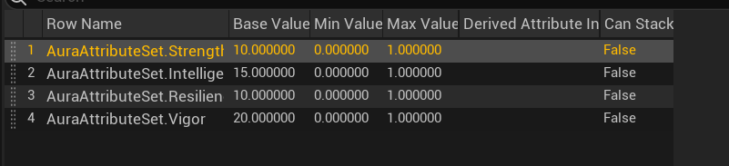

## 前言

这一节我们主要是通过GE的不同的方式来设置Attributes，主要是GE中的CalculateMagnitudeType来决定的；很有意思的一章，在这里我们可以将游戏中所需要的属性设置完毕；f

## Initialize Attributes from a DT

1. 目前为止，我们有了VitalAttributes,接下来我们将设置PrimaryAttributes,通过数据表的形式，当然我们首先需要将这些属性进行声明，所以复习一下声明属性的步骤吧；

```
UAuraAttributeSet.h
UPROPERTY(BlueprintReadOnly, ReplicatedUsing = OnRep_ArmorPenetration, Category = "Secondary Attribute")
FGameplayAttributeData Strength;
ATTRIBUTE_ACCESSORS(UAuraAttributeSet, Strength);

UFUNCTION()
void OnRep_Strength(const FGameplayAttributeData& OldStrength) const;

UAuraAttributeSet.cpp
void UAuraAttributeSet::OnRep_Strength(const FGameplayAttributeData& OldStrength) const
{
	GAMEPLAYATTRIBUTE_REPNOTIFY(UAuraAttributeSet, Strength, OldStrength);
}

DOREPLIFETIME_CONDITION_NOTIFY(UAuraAttributeSet, Strength, COND_None, REPNOTIFY_Always);
```

按照上述步骤，将4个primaryAttributes设置好就可以了；

2. 既然属性声明好了，我们应该考虑怎样初始化他。

ASC提供了一种方式，就是使用数据表，但是我们应该将ASC暴露给蓝图，否则无法从蓝图中操作；


将其暴露给蓝图后，在ASC的Detail面板中就不会再是空白，而是有内容了；

在细节面板下，我们可以看到如图下选项，选择就可以；


要使用数据表，肯定需要相应的RowStruct,不然采用什么行结构呢？GAS提供了一种关于初始化数据结构；


然后定义这个数据表



然后在ASC里面选择就可以了；

## Initialize Attributes with GameplayEffects

初始化属性的方式我们一般有使用ATTRIBUTES_ACESSER的函数来硬编码，有上面的数据表的形式，有接下来提到的GE初始化。我们一般选择GE初始化，而不是其他二者；第一种方式过于简陋，第二种方式又在功能上欠缺，只能做一个初始化的作用。

用GE初始化的大概思路是定义好GE,然后ApplyGEToSelf;

1. 定义好GE是非常直观简单的，但最重要的却是声明一个指针来指向它，达到在c++使用该GE的目的；

   属性是要应用在Character上面的，所以我们在AuraCharacterBase.h里面声明一个GE类型的指针；

   ```
   	UPROPERTY(BlueprintReadOnly,EditAnywhere,Category="Attributes")
   	TSubclassOf<UGameplayEffect> DefaultPrimaryAttribute;
   ```

然后定义好一个包含主要属性的GE


2. ApplyEffect
   定义好GE就将它应用到需要应用的类上面去，在这里我们需要将其应用到CharacterBase上面。
   因为我们后面还需要对该类应用其他属性通过这种方式，所以我们的ApplyEffect函数需要注意这一点来进行设计；
   ```
   void AAuraCharacterBase::ApplyEffectToSelf(TSubclassOf<UGameplayEffect> DefaultAttribute, float level) const
   {
   	check(IsValid(GetAbilitySystemComponent()));
   	check(DefaultAttribute);
   	FGameplayEffectContextHandle EffectContextHandle = GetAbilitySystemComponent()->MakeEffectContext();
   	EffectContextHandle.AddSourceObject(this);
   	const FGameplayEffectSpecHandle EffectSpecHandle = GetAbilitySystemComponent()->MakeOutgoingSpec(DefaultAttribute, level, EffectContextHandle);
   	GetAbilitySystemComponent()->ApplyGameplayEffectSpecToTarget(*EffectSpecHandle.Data.Get(), GetAbilitySystemComponent());
   }
   void AAuraCharacterBase::InitializeDefaultAttribute() const
   {
   	ApplyEffectToSelf(DefaultPrimaryAttribute, 1);
   	ApplyEffectToSelf(DefaultSecondaryAttribute, 1);
   	ApplyEffectToSelf(DefaultVitalAttribute, 1);
   }
   ```

第一个函数是使用ASC将GE应用到Target上面，第二个函数是专门用来调用第一个函数的中转函数；所以这个中转函数应该放在哪里，让其被调用呢？

我们将其放在AuraCharacter的InitAbilityActroInfo()函数里面；

## Attribute Based Modifiers

前面我们一直在使用的Modifier Magnitude是Scalable Float,接下来我们就介绍其他三种类型，先来介绍AttributeBased类型

这种方式就是让你选择的Attribute的值基于其他的Attribute;这种灵活的方式可以让我们设置属性之间的依赖，一个属性的增长基于另一个属性；如下图；


可以看到有三个数值，他们的使用如下图；


## Secondary Attributes

前面提到了一些属性是依赖其他属性的，他们的值的变化是跟着一些属性的值的变化而变化的；

这些属性的设计如下


设计好这些属性后就可以在AttributeSet里面声明这些属性了

声明完后就应该在GE里定义这些属性，除了MaxHealth和MaxMana都采用AttributesBased的方式来设计这些属性的大小；

同样为了让GE应用到角色上面，我们还是用指针指向这个GE,TSubclassOf `<GE>`

## Custom Calculations

前面提到关于Calcuation Magnitude Type,现在介绍第三种方式，MMC,为什么需要这种类呢？首先，他需要我们自己定义这个类，然后它使用CalculateBaseMagnitude_Implementation函数的返回值当作属性的值；

使用这个类主要是为了这样的需要，一个属性的值不仅取决于其他的属性，同样取决于Model中的变量，比如Max Health的设计就是基于Vigor和玩家等级，所以为了获取玩家等级就需要我们使用MMC;

我们提到MaxHealth的设计需要玩家等级，所以我们需要先设计玩家等级；

## Player Level & Combat Interface

玩家等级应该被设计在什么地方合理呢？首先不能设计在Pawn中，假如Pawn死亡，那么我们重新生成的Pawn将会从0开始，也就是它的数据没了，所以还是那句话我们将数据放在一个不会因为玩家死亡就消失的地方，PlayerState就刚好合适，毕竟是State嘛；

```
AuraPlayerState.h
private:
UPROPERTY(VisibleAnywhere, ReplicatedUsing = OnRep_Level)
int32 Level=1;

UFUNCTION()
void OnRep_Level(int32 OldLevel) const;
public:
inline int32 GetPlayerLevel() const { return Level; }

AuraPlayerState.cpp
void AAruaPlayerState::OnRep_Level(int32 OldLevel) const
{
//Nothing;
}

void AAruaPlayerState::GetLifetimeReplicatedProps(TArray<FLifetimeProperty>& OutLifetimeProps) const
{
	Super::GetLifetimeReplicatedProps(OutLifetimeProps);

	DOREPLIFETIME(AAruaPlayerState, Level);
}
```

从代码中可以看到添加一个重要变量需要进行复制，而一个变量进行复制需要进行声明，这种声明让一个变量被声明为可复制；

Enemy的PlayerLevel设计

```
AuraEnemy.h
class TOPDOWNGAME_API AAuraEnemy : public AAuraCharacterBase,public IEnemyInterface
{
protected:
	UPROPERTY(VisibleAnywhere, BlueprintReadOnly, Category = "Character class Default")
	int32 Level=1;
public:
	virtual int32 GetPlayerLevel() override;
}
```

可以看到我们又设计了个接口类，这个接口类中有如下内容：

```
CombatInterface.h

public:
	virtual int32 GetPlayerLevel();
.cpp
int32 ICombatInterface::GetPlayerLevel()
{
	return 0;
}
```

可以看到它并非纯虚函数，所以我们继承自该接口的类不一定要重写该函数；

问题来了，为什么要设计这么一个接口呢？我们在各自的类里面写Geter函数不好嘛？解释这个问题之前我们先看一下AuraCharacterBase

Base类也继承了ICombatInterface,但是我们并没有在这里重写，而是只在这里继承，这也是为什么接口不写成纯虚函数的原因，因为我们不需要在Base里返回等级，而是在Base的子类里返回等级；既然是子类中返回等级，那么我们该看看AuraCharacter了

```
virtual int32 GetPlayerLevel() override;
int32 AAuraCharacter::GetPlayerLevel()
{
	AAruaPlayerState* AuraPlayerState = GetPlayerState<AAruaPlayerState>();
	check(AuraPlayerState);
	return AuraPlayerState->GetPlayerLevel();
}
```

玩家的等级设计及获取结束了，但是有一个问题是为什么要设计这么一个CombatInterface类呢？我们在Base里面写一个获取等级的虚函数不好吗，它肯定是可行的，但是为什么不这么做呢？

首先设计这么一类是很灵活的，可能以后还有Character而不是继承自Base类，这个时候需要获取等级就不是重写虚函数了，而是要再设计函数。

再者，方便代码的管理，将有关Combat的接口全放到接口类，代码结构是很清晰的；

总结一下就是，涉及到这多个类继承自一个类且需要同一种功能的函数，可以设计一个接口。我们可以回顾一下IEnemyInterface接口类；

因为我们需要鼠标在敌人身上是高亮。所以我们鼠标挪到敌人身上，应该检测一下有没有一个类，有这个类就高亮。这种设计就很灵活，只有接口类的敌人才会亮，而不是所有的敌人。

## MMC

前面提到过MMC的设计初衷，是为了引入变量在GE中，具体的思路是怎样的呢？

当MMC被应用到GE的时候，会调用CalculateBaseMagnitude_Implementation(const FGameplayEffectSpec& Spec) 函数，这个函数返回一个浮点值，作为属性的值；

现在以对MaxMana为例，它的值基于一个浮点值，一个Attribute的Mag,一个变量。所以我们需要在这个函数中设置好这个属性的mag和变量，获取属性是通过一个定义好的函数GetCapturedAttributeMagnitude(),然后变量的获取是基于我们前面写好的接口；

```
FGameplayEffectAttributeCaptureDefinition IntelligenceDef;

float UMMC_MaxMana::CalculateBaseMagnitude_Implementation(const FGameplayEffectSpec& Spec) const
{
	//Gather Tags from Source and Target;
	const FGameplayTagContainer* SourceTags = Spec.CapturedSourceTags.GetAggregatedTags();
	const FGameplayTagContainer* TargetTags = Spec.CapturedTargetTags.GetAggregatedTags();

	FAggregatorEvaluateParameters EvaluateParameters;
	EvaluateParameters.SourceTags = SourceTags;
	EvaluateParameters.TargetTags = TargetTags;

	float Intelligence = 0.f;
	GetCapturedAttributeMagnitude(IntelligenceDef, Spec, EvaluateParameters, Intelligence);
	Intelligence = FMath::Max<int>(Intelligence, 0);

	ICombatInterface* CombatInterface = Cast<ICombatInterface>(Spec.GetContext().GetSourceObject());
	const int32 PlayerLevel = CombatInterface->GetPlayerLevel();
	return 50.f + 2.5f * Intelligence + 15.f * PlayerLevel;
}
```

因为函数的参数的需要，我们需要声明变量并赋值

```
UMMC_MaxMana::UMMC_MaxMana()
{
	IntelligenceDef.AttributeToCapture = UAuraAttributeSet::GetIntelligenceAttribute();
	IntelligenceDef.AttributeSource = EGameplayEffectAttributeCaptureSource::Target;
	IntelligenceDef.bSnapshot = false;

	RelevantAttributesToCapture.Add(IntelligenceDef);
}
```

Over!

当然我们可以将VitalAttribute也可以通过GE来初始化；这样我们的属性的值都已经被正常的初始化了；
