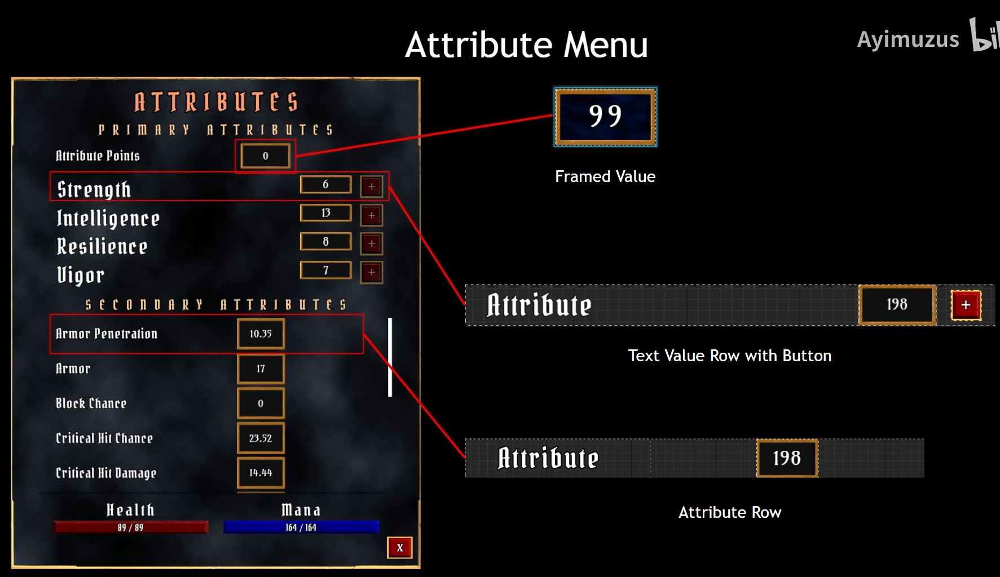
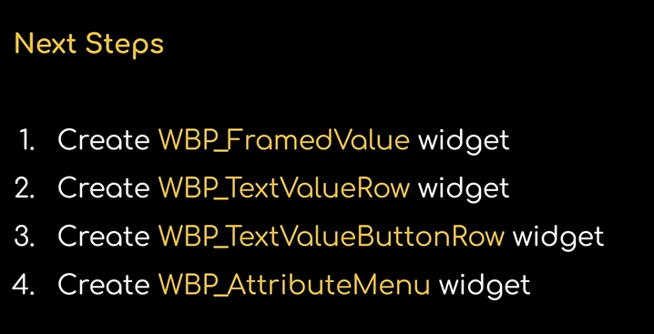
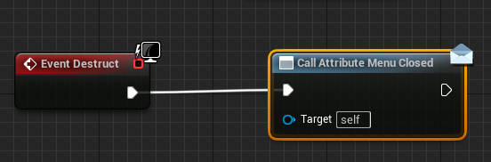
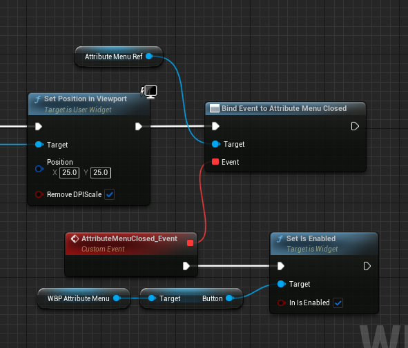
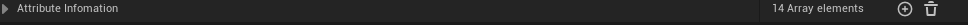
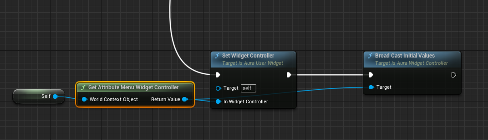
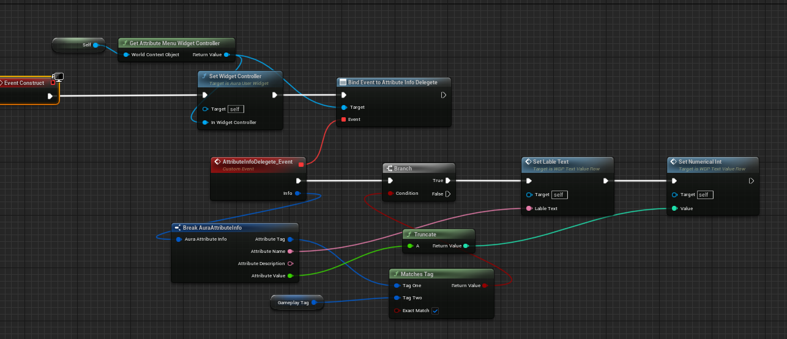
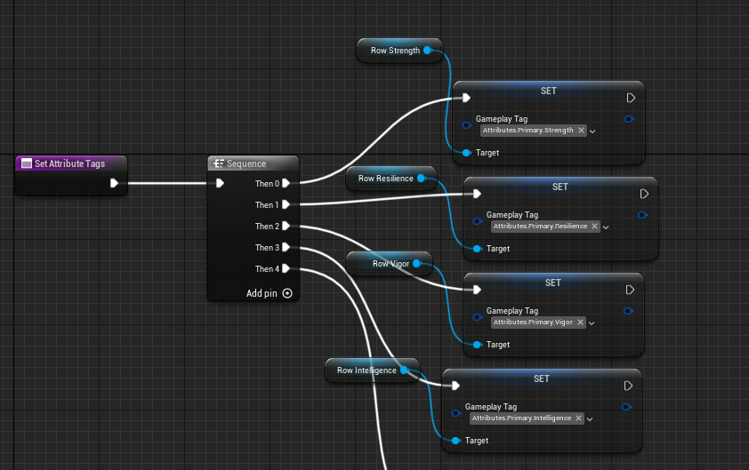

## Plan

我们需要完成的任务就是将下图的UI全做出来；并且将正确的数据显示出来；





关于UI的设计其实没什么好说的，这里就是有用到一个蓝图的委托，也就是事件分发器。

## Event Dispatchers



当Destruct启动，该委托发送消息，然后其回调函数被调用



关于蓝图和UI的设计就到此位置，我们主要来看如何将数据发送给UI;

## 头脑风暴

我们应该继续采用MVC架构，使用Controller将数据发送给UI。现在我们的需求是将AttributeSet里面的数据发送，那么我们就要设计一个关于Attribute的Controller,其负责将数据发送给UI。但是我们的AttributeMenu应该怎么样去识别它发送的数据也是个问题，这里就会采用到GameplayTag,通过比对Tag来将合适的数据发送给合适的UI。但现在我们不可能一条一条的将属性发送，这样当我们给添加一个新属性的时候，就要更改Controller里的代码，我们希望Controller更加智能。来看看具体怎么做吧。

## Gameplay Tags Singleton

因为我们需要在Controller中做这样一件事，就是将属性的一些信息发送给Widget,这里就会使用GameplayTag,但是在C++中使用Tag很麻烦（RequestGameplayTag),就不可以直接将编辑器里的Tag拿过来使用，所以我们就在C++中写这种Native Tag用变量的形式来替代编辑器中的部分Tag。

我们设计一个类来专门存储Tags,使用单例模式，因为我们不需要多余的副本，只要一个就够了。多了用不上，也容易造成混乱；

```
AuraGameplayTags.h
struct FAuraGameplayTags
{
public:


	static const FAuraGameplayTags& Get() { return GameplayTags; }
	static const void InitializeNativeGameplayTags();

	FGameplayTag Attributes_Primary_Strength;
	FGameplayTag Attributes_Primary_Intelligence;
	FGameplayTag Attributes_Primary_Resilience;
	FGameplayTag Attributes_Primary_Vigor;

	FGameplayTag Attributes_Secondary_MaxHealth;
	FGameplayTag Attributes_Secondary_MaxMana;
	FGameplayTag Attributes_Secondary_Armor;
	FGameplayTag Attributes_Secondary_ArmorPenetration;
	FGameplayTag Attributes_Secondary_BlockChance;
	FGameplayTag Attributes_Secondary_CriticalHitChance;
	FGameplayTag Attributes_Secondary_CriticalHitDamage;
	FGameplayTag Attributes_Secondary_CriticalHitResistance;
	FGameplayTag Attributes_Secondary_HealthRegeneration;
	FGameplayTag Attributes_Secondary_ManaRegeneration;
private:
	static  FAuraGameplayTags GameplayTags;
};
AuraGameplayTags.cpp
/*
* 下面这行代码定义并初始化静态成员变量了。确保在程序的声明周期内只被创建一次；
*/
FAuraGameplayTags FAuraGameplayTags::GameplayTags;


const void FAuraGameplayTags::InitializeNativeGameplayTags()
{
	/*
	* AddNativeGameplayTag将给定名称注册为GamePlayTags;
	* SecondaryAttributes
	*/
	GameplayTags.Attributes_Secondary_Armor =UGameplayTagsManager::Get().AddNativeGameplayTag(
		FName("Attributes.Secondary.Armor"),
		FString("Reduces damage taken,improves Block Chance")
	);

	GameplayTags.Attributes_Secondary_ArmorPenetration = UGameplayTagsManager::Get().AddNativeGameplayTag(
		FName("Attributes.Secondary.ArmorPenetration"),
		FString("Ingnore Percentage of enemy Armor,Increace Critical Hit Chance")
	);

	GameplayTags.Attributes_Secondary_BlockChance = UGameplayTagsManager::Get().AddNativeGameplayTag(
		FName("Attributes.Secondary.BlockChance"),
		FString("Chance to cut incoming damage in half")
	);

	GameplayTags.Attributes_Secondary_CriticalHitChance = UGameplayTagsManager::Get().AddNativeGameplayTag(
		FName("Attributes.Secondary.CriticalHitChance"),
		FString("Chance to double damage plus critical hit bonus")
	);

	GameplayTags.Attributes_Secondary_CriticalHitDamage= UGameplayTagsManager::Get().AddNativeGameplayTag(
		FName("Attributes.Secondary.CriticalHitDamage"),
		FString("Bonus damage added whe a critical hit is scored")
	);

	GameplayTags.Attributes_Secondary_CriticalHitResistance = UGameplayTagsManager::Get().AddNativeGameplayTag(
		FName("Attributes.Secondary.CriticalHitResistance"),
		FString("Reduces Critical Hit Chance of attacking enemies")
	);

	GameplayTags.Attributes_Secondary_HealthRegeneration = UGameplayTagsManager::Get().AddNativeGameplayTag(
		FName("Attributes.Secondary.HealthRegeneration"),
		FString("Amount of Health regerated every 1 second")
	);

	GameplayTags.Attributes_Secondary_ManaRegeneration = UGameplayTagsManager::Get().AddNativeGameplayTag(
		FName("Attributes.Secondary.ManaRegeneration"),
		FString("Amount of Mana regerated every 1 second")
	);

	GameplayTags.Attributes_Secondary_MaxHealth = UGameplayTagsManager::Get().AddNativeGameplayTag(
		FName("Attributes.Secondary.MaxHealth"),
		FString("Maximum amount of Health Obtainable")
	);

	GameplayTags.Attributes_Secondary_MaxMana = UGameplayTagsManager::Get().AddNativeGameplayTag(
		FName("Attributes.Secondary.MaxMana"),
		FString("Maximum amount of Mana Obtainable")
	);
	/*
	* PrimaryAttributes
	*/
	GameplayTags.Attributes_Primary_Strength = UGameplayTagsManager::Get().AddNativeGameplayTag(
		FName("Attributes.Primary.Strength"),
		FString("Increase physical damage")
	);

	GameplayTags.Attributes_Primary_Intelligence = UGameplayTagsManager::Get().AddNativeGameplayTag(
		FName("Attributes.Primary.Intelligence"),
		FString("Increase magical damage")
	);

	GameplayTags.Attributes_Primary_Resilience = UGameplayTagsManager::Get().AddNativeGameplayTag(
		FName("Attributes.Primary.Resilience"),
		FString("Increase Armor and Armor Penetration")
	);

	GameplayTags.Attributes_Primary_Vigor = UGameplayTagsManager::Get().AddNativeGameplayTag(
		FName("Attributes.Primary.Vigor"),
		FString("Increase Health")
	);
}
```

可以看到单例模式在c++中的使用，使用静态的方式获取成员变量，静态成员不需要创建对象就可以使用。可以看到FGameplayTag类型的变量全被AddNativeGameplayTag初始化为我们想要的Tag。

现在我们在哪里调用这个InitializeNativeGameplayTags()函数呢？这就需要我们设计另外一个类，主要是为了加载我们的主要资产。我们希望游戏一开始这些变量已经被初始化好了，但是放在资产管理里面来加载这些Tag更好一点。

所以我们接下来设计我们的AssetManager

## AuraAssetManager

```
AuraAssetManager.h
UCLASS()
class TOPDOWNGAME_API UAuraAssetManager : public UAssetManager
{
	GENERATED_BODY()
public:
	static const UAuraAssetManager& Get();

protected:
	virtual void StartInitialLoading();
};
AuraAssetMangaer.cpp
const UAuraAssetManager& UAuraAssetManager::Get()
{
	UAuraAssetManager* AssetManager=Cast<UAuraAssetManager>(GEngine->AssetManager.Get());
	return *AssetManager;
	// TODO: 在此处插入 return 语句
}

void UAuraAssetManager::StartInitialLoading()
{
	Super::StartInitialLoading();

	FAuraGameplayTags::InitializeNativeGameplayTags();
}
```

可以看到资源管理器也是采用单例模式。可以看到我们获取该单例的方式，因为我们继承自UAssetManager,所以并没有再写一个私有对象，而是采用继承的方式，将其类型转换为子类。

## AttributeInfo

我们知道Contorller发送信息给Widget，但具体发送什么样的消息呢？这就是我们设计的AttributeInfo,这种类型的数据将被发送给Widget。

```
USTRUCT(BlueprintType)
struct FAuraAttributeInfo
{
	GENERATED_BODY()

	UPROPERTY(EditDefaultsOnly,BlueprintReadOnly)
	FGameplayTag AttributeTag=FGameplayTag();

	UPROPERTY(EditDefaultsOnly, BlueprintReadOnly)
	FText AttributeName = FText();

	UPROPERTY(EditDefaultsOnly, BlueprintReadOnly)
	FText AttributeDescription = FText();

	UPROPERTY(BlueprintReadOnly)
	float AttributeValue = 0.f;
};
/**
 * 
 */
UCLASS()
class TOPDOWNGAME_API UAttributesInfo : public UDataAsset
{
	GENERATED_BODY()
public:

	FAuraAttributeInfo FindAttributeInfoForTag(const FGameplayTag& AttributeTag, bool bLogNotFound = false);

	UPROPERTY(EditDefaultsOnly,BlueprintReadOnly)
	TArray<FAuraAttributeInfo>AttributeInfomation;

};
```

注意到AttributeValue的值只能BlueprintReadOnly,这是因为属性的值由AttributeSet和GE控制。

可以看到根据Tag查信息的方法放到了这个类里，而没有放到Controller类里面，这样做的好处是只要有需要查信息的地方，就不用再写查信息的函数。

我们希望借这个类来编辑DataAsset,所以写一个成员变量TArry.其效果如下图



## AttributeMenu Widget Controller

因为它担任着发送数据的任务，所以继承自AuraWidgetController.它需要发送AttributeInfo,所以应该有一个委托。它要初始化我们的Widget上的数据，所以它的BroadCastInitialValues需要重写。当属性的值发生变化的时候我们需要用ASC的委托来绑定回调函数，所以我们需要重写BindCallbacksToDependencies.因为Controller需要在AttributeInfo里挑选合适的信息发送，所以应该有AttributeInfo的指针。有了这些需求，.h里面需要做的就出来了。

```
AttributeMenuWidgetContrtoller.h
struct FAuraAttributeInfo;
DECLARE_DYNAMIC_MULTICAST_DELEGATE_OneParam(FAttributeInfoSignature, const FAuraAttributeInfo&, Info);
/**
 * 
 */
UCLASS(BlueprintType,Blueprintable)
class TOPDOWNGAME_API UAttributeMenuWidgetController : public UAuraWidgetController
{
	GENERATED_BODY()


public:
	virtual void BindCallbacksToDependencies() override;


	virtual void BroadCastInitialValues() override;

	UPROPERTY(BlueprintAssignable, Category = "GAS|Attributes")
	FAttributeInfoSignature AttributeInfoDelegete;

protected:
	UPROPERTY(EditDefaultsOnly)
	TObjectPtr<UAttributesInfo> AttributeInfo;

private:
	void BroadAttributeInfo(const FGameplayTag Tags, const FGameplayAttribute Attribute) const;
};
```

类是设计，是灵魂是指示，但是Cpp则是行为。

```
.cpp

void UAttributeMenuWidgetController::BindCallbacksToDependencies()
{
	UAuraAttributeSet* AS = CastChecked<UAuraAttributeSet>(AttributeSet);
	for (auto& Pair : AS->TagsToAttributes)
	{
		AbilitySystemComponent->GetGameplayAttributeValueChangeDelegate(Pair.Value()).AddLambda(
			[this,Pair](const FOnAttributeChangeData& Data) {
				BroadAttributeInfo(Pair.Key, Pair.Value());
			}
		);
	}

}

void UAttributeMenuWidgetController::BroadCastInitialValues()
{
	UAuraAttributeSet* AS = CastChecked<UAuraAttributeSet>(AttributeSet);

	check(AttributeInfo);
	//FAuraAttributeInfo Info = AttributeInfo->FindAttributeInfoForTag(FAuraGameplayTags::Get().Attributes_Primary_Strength);

	//Info.AttributeValue = AS->GetStrength();
	//AttributeInfoDelegete.Broadcast(Info);

	for (auto& Pair : AS->TagsToAttributes)
	{
		BroadAttributeInfo(Pair.Key, Pair.Value());
	}
}

void UAttributeMenuWidgetController::BroadAttributeInfo(const FGameplayTag Tags, const FGameplayAttribute Attribute) const
{
	FAuraAttributeInfo Info = AttributeInfo->FindAttributeInfoForTag(Tags); 
	Info.AttributeValue = Attribute.GetNumericValue(AttributeSet);
	AttributeInfoDelegete.Broadcast(Info);
}
```

AttributeSet是个变量，可以看到类文件中并没有，他是从父类中继承过来的，那么在哪里我们对其进行了初始化呢，类设计好了，但总是需要地方去使用它。

```
AuraHUD.h
private:
	UPROPERTY()
	TObjectPtr<UAttributeMenuWidgetController>AttributeMenuWidgetController;

	UPROPERTY(EditAnywhere)
	TSubclassOf<UAttributeMenuWidgetController>AttributeMenuWidgetControllerClass;
pubilic:
UAttributeMenuWidgetController* GetAttributeMenuWidgetController(const FWidgetControllerParams& WCParams);

```

```
AuraHUD.cpp
UAttributeMenuWidgetController* AAuraHUD::GetAttributeMenuWidgetController(const FWidgetControllerParams& WCParams)
{
	if (AttributeMenuWidgetController == nullptr)
	{
		AttributeMenuWidgetController = NewObject<UAttributeMenuWidgetController>(this, AttributeMenuWidgetControllerClass);
		AttributeMenuWidgetController->SetWidgetControllerParams(WCParams);
		AttributeMenuWidgetController->BindCallbacksToDependencies();
	}
	return AttributeMenuWidgetController;
}
```

可以看到在HUD中有该Controller的变量和Class，在Geter方法中我们设置了该Controller需要的Model,WCParams.那么在哪里调用该方法，并且将WCParams传给它呢？

在以往我们是在Character里面调用HUD的InitOverlay函数，将4个参数传递给该函数。现在我们使用蓝图库方法，这样我们可以在想要的任何地方调用它。

```
AuraAbilitySystemLibrary.h
UCLASS()
class TOPDOWNGAME_API UAuraAbilitySystemLibrary : public UBlueprintFunctionLibrary
{
	GENERATED_BODY()

public:
	UFUNCTION(BlueprintPure, Category = "AuraAbilitySystemLibrary|WidgetController")
	static UOverlayWidgetController* GetOverlayWidgetController(const UObject* WorldContextObject);

	UFUNCTION(BlueprintPure, Category = "AuraAbilitySystemLibrary|WidgetController")
	static UAttributeMenuWidgetController* GetAttributeMenuWidgetController(const UObject* WorldContextObject);
};
```

将其声明为纯函数。（纯函数的输出仅仅依赖于输入）

```
AuraAbilitySystemLibrary.cpp
UOverlayWidgetController* UAuraAbilitySystemLibrary::GetOverlayWidgetController(const UObject* WorldContextObject)
{
	if (APlayerController* PC = UGameplayStatics::GetPlayerController(WorldContextObject, 0))
	{
		if (AAuraHUD* AuraHUD = Cast<AAuraHUD>(PC->GetHUD()))
		{
			AAruaPlayerState* PS = PC->GetPlayerState<AAruaPlayerState>();
			UAbilitySystemComponent* ASC = PS->GetAbilitySystemComponent();
			UAttributeSet* AS = PS->GetAttributeSet();
			const FWidgetControllerParams WidgetControllerParams(PC, PS, ASC, AS);
			return AuraHUD->GetOverlayWidgetController(WidgetControllerParams);
		}
	}
	return nullptr;
}

UAttributeMenuWidgetController* UAuraAbilitySystemLibrary::GetAttributeMenuWidgetController(const UObject* WorldContextObject)
{
	if (APlayerController* PC = UGameplayStatics::GetPlayerController(WorldContextObject, 0))
	{
		if (AAuraHUD* AuraHUD = Cast<AAuraHUD>(PC->GetHUD()))
		{
			AAruaPlayerState* PS = PC->GetPlayerState<AAruaPlayerState>();
			UAbilitySystemComponent* ASC = PS->GetAbilitySystemComponent();
			UAttributeSet* AS = PS->GetAttributeSet();
			const FWidgetControllerParams WidgetControllerParams(PC, PS, ASC, AS);
			return AuraHUD->GetAttributeMenuWidgetController(WidgetControllerParams);
		}
	}
	return nullptr;
}
```

这样，只要有地方调用我们的Getter函数，那么我们的Controller里面的Model部分就会被设置好。如下图调用



## AuraAttributeSet

### TagsToAttibutes

我们在widgetcontroller里面有看到一个有意思的东西TagsToAttibutes,正是因为它，我们不需要将属性一个一个的广播，而是做一个循环就可以了。我们可以看到Tag比对后将AttibuteInfo发送，但是它的数据还没有被编辑，这时候发送过去的也只不过是空壳。所以我们需要将AttributeValue编辑后发送。怎么编辑呢？我们需要从AttributeSet中获取，而获取的方法就是GetStrengthAttribute().Value()。所以我们需要给定的Tag和Value存储在Map中。

```
AuraAttributeSet.h
template<class T>
using TStaticFuncPtr = typename TBaseStaticDelegateInstance<T, FDefaultDelegateUserPolicy>::FFuncPtr;
TMap<FGameplayTag, TStaticFuncPtr<FGameplayAttribute()>> TagsToAttributes;
```

可以看到使用了指针函数，指针函数的方便之处就是使用函数名就相当于使用了函数，非常的方便

```
AuraAttributeSet.cpp
UAuraAttributeSet::UAuraAttributeSet()
{
	const FAuraGameplayTags& GameplayTags = FAuraGameplayTags::Get();

	/*Primary Attribute*/
	TagsToAttributes.Add(GameplayTags.Attributes_Primary_Strength, GetStrengthAttribute);
	TagsToAttributes.Add(GameplayTags.Attributes_Primary_Intelligence, GetIntelligenceAttribute);
	TagsToAttributes.Add(GameplayTags.Attributes_Primary_Resilience, GetResilienceAttribute);
	TagsToAttributes.Add(GameplayTags.Attributes_Primary_Vigor, GetVigorAttribute);

	/*Secondary Attribute*/
	TagsToAttributes.Add(GameplayTags.Attributes_Secondary_Armor, GetArmorAttribute);
	TagsToAttributes.Add(GameplayTags.Attributes_Secondary_ArmorPenetration, GetArmorPenetrationAttribute);
	TagsToAttributes.Add(GameplayTags.Attributes_Secondary_BlockChance, GetBlockChanceAttribute);
	TagsToAttributes.Add(GameplayTags.Attributes_Secondary_CriticalHitChance, GetCriticalHitChanceAttribute);
	TagsToAttributes.Add(GameplayTags.Attributes_Secondary_CriticalHitDamage, GetCriticalHitDamageAttribute);
	TagsToAttributes.Add(GameplayTags.Attributes_Secondary_CriticalHitResistance, GetCriticalHitDamageAttribute);
	TagsToAttributes.Add(GameplayTags.Attributes_Secondary_HealthRegeneration, GetHealthRegenerationAttribute);
	TagsToAttributes.Add(GameplayTags.Attributes_Secondary_ManaRegeneration, GetManaRegenerationAttribute);
	TagsToAttributes.Add(GameplayTags.Attributes_Secondary_MaxHealth, GetMaxHealthAttribute);
	TagsToAttributes.Add(GameplayTags.Attributes_Secondary_MaxMana, GetMaxManaAttribute);
\
}
```

这样我们的数据完整的被发送了。

那么我们的Widget如何识别发送过来的数据，让每一个Row能够识别自己的Attribute。

## WBP_TextValueRow





这两张图就解释了如何识别tag的，给每个Row添加一个GameplayTag的变量，然后进行MatchTag就好了。
