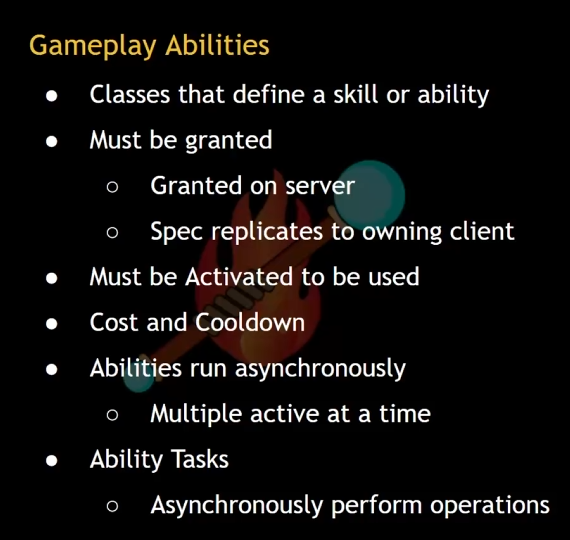
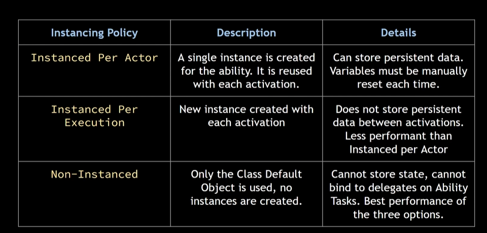
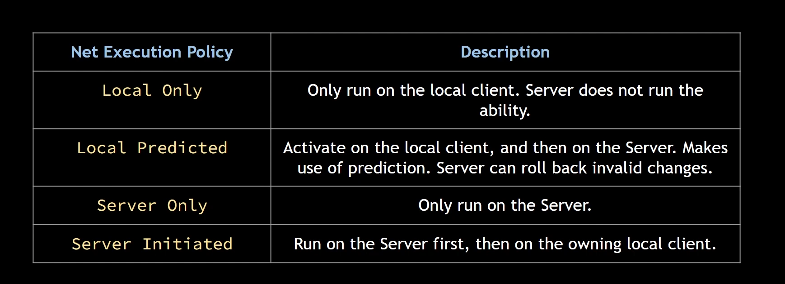
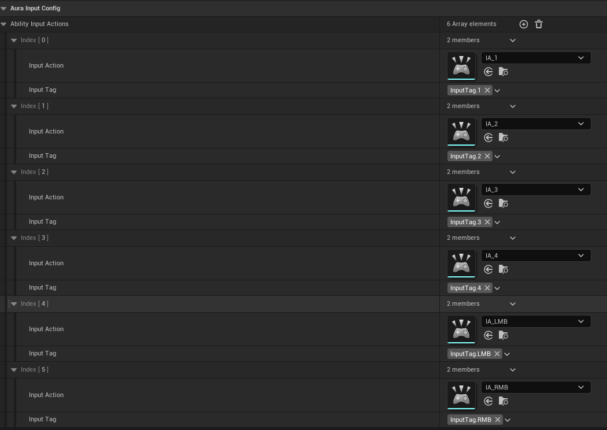

## What?



## GrantAbility

能力授予必须由服务端来，ASC挂在PlayerState上面，所以Grant的事情交给ASC来做；

```
ASC.h
void AddCharacterAbilities(const TArray<TSubclassOf<UGameplayAbility>>& StartUpAbilities);
```

```
ASC.cpp
void UAuraAbilitySystemComponent::AddCharacterAbilities(const TArray<TSubclassOf<UGameplayAbility>>& StartUpAbilities)
{
	for (TSubclassOf<UGameplayAbility>Abilities : StartUpAbilities)
	{
		FGameplayAbilitySpec AbilitySpec = FGameplayAbilitySpec(Abilities, 1);
		//GiveAbility(AbilitySpec);
		GiveAbilityAndActivateOnce(AbilitySpec);
	}
}
```

可以看到先是通过Class创建了Spec,然后将Spec激活。

我们现在给Character来添加能力，当然需要先来个能力数组

```
Character.h
private:
	UPROPERTY(EditAnywhere, Category = "Abilities")
	TArray<TSubclassOf<UGameplayAbility>>StartUpAbilities;
protected:
	void AddCharacterAbilities();
```

```
Character.cpp
void AAuraCharacterBase::AddCharacterAbilities()
{
	UAuraAbilitySystemComponent* AuraASC = CastChecked<UAuraAbilitySystemComponent>(AbilitySystemComponent);
	if (!HasAuthority()) return;

	AuraASC->AddCharacterAbilities(StartUpAbilities); 
}
```

检查权限后调用ASC的AddCharacterAbilities()函数。

问题又来了，那么现在这个Character里面的AddAddCharacterAbilities()哪里调用呢？

在PossessBy函数中，这个函数负责了一些初始化逻辑和启用和禁止某些功能的逻辑。

## GA's Policy

Instancing Policy



Net Execution Policy



## Input Config Data Asset

现在我们将为GA配置输入，我们希望它与GameplayTag配合，是灵活的。希望能够在运行时改变键位配置。基于此要求，我们会有一种资产，这种资产有InputAction,它具体绑定到哪个键上是根据GameplayTag来定的，假如GameplayTag是IntputTag.LMB,那么对应的Acton就是左键。

我们先看这种结构、

```
AuraInputConfig.h
USTRUCT(BlueprintType)
struct FAuraInputAction
{
	GENERATED_BODY()

	UPROPERTY(EditDefaultsOnly)
	const class UInputAction* InputAction = nullptr;
	UPROPERTY(EditDefaultsOnly)
	FGameplayTag InputTag = FGameplayTag();
};
/**
 * 
 */
UCLASS()
class TOPDOWNGAME_API UAuraInputConfig : public UDataAsset
{
	GENERATED_BODY()

public:

	const UInputAction* FindAbilityInputActionForTag(const FGameplayTag &Tag,bool bLogNotFound=false);

	UPROPERTY(EditDefaultsOnly,BlueprintReadOnly)
	TArray<FAuraInputAction> AbilityInputActions;
};


```

可以看到这种结构，我们根据该结构来创建DA,根据该类创建的DA,会有该结构数组，然后我们还有一个函数，根据Tag,来将对应的InputAction返回。

```
AuraInputConfig.cpp
const UInputAction* UAuraInputConfig::FindAbilityInputActionForTag(const FGameplayTag& Tag, bool bLogNotFound)
{
    for (auto& Action : AbilityInputActions)
    {
        if (Action.InputAction && Action.InputTag == Tag)
        {
            return Action.InputAction;
        }
    }

    if (bLogNotFound)
    {
        UE_LOG(LogTemp, Error, TEXT("找不到标签[%s]"), *Tag.ToString());
    }
    return nullptr;
}

```

根据该DA类来创建DA



同时，Action也要被创建，对应的键位到IMC中设置。

## AuraInputComponent

我们对Input有着更加复杂的要求，我们希望它能够同时处理多种输入的同时并且接受指定的参数给回调函数。因此我们有了继承UEnhancedInputComponent
的想法，并且将BindAction封装，来达到同时处理多种输入的想法；

```
AuraInputComponent.h
UCLASS()
class TOPDOWNGAME_API UAuraInputComponent : public UEnhancedInputComponent
{
	GENERATED_BODY()

public:
	template<class UserClass,typename HeldFuncType,typename ReleasedFuncType,typename PressedFuncType>
	void BindAbilityActions(const UAuraInputConfig* Config, UserClass* Object, HeldFuncType HeldFunc, ReleasedFuncType ReleasedFunc, PressedFuncType PressedFunc);

};

template<class UserClass, typename HeldFuncType, typename ReleasedFuncType, typename PressedFuncType>
inline void UAuraInputComponent::BindAbilityActions(const UAuraInputConfig* Config, UserClass* Object, HeldFuncType HeldFunc, ReleasedFuncType ReleasedFunc, PressedFuncType PressedFunc)
{
	check(Config);

		for (const FAuraInputAction& Action : Config->AbilityInputActions)
		{
			if (Action.InputAction && Action.InputTag.IsValid())
			{
				if (PressedFunc)
				{
					BindAction(Action.InputAction, ETriggerEvent::Started, Object, PressedFunc, Action.InputTag);
				}
				if (HeldFunc)
				{
					BindAction(Action.InputAction, ETriggerEvent::Triggered, Object, HeldFunc, Action.InputTag);
				}
				if (ReleasedFunc)
				{
					BindAction(Action.InputAction, ETriggerEvent::Completed, Object, ReleasedFunc, Action.InputTag);
				}
			}
		}
}
```

Config中存有相应的Action，我按了一下，就会触发Started事件，使用回调函数，然后回调函数相应。

这里再解释一下Action，当我们将Action绑定到某个键上时，我们触发了该键，Action就会有输入，它接受你Started,Triggered之类的输入，然后触发回调函数。这里的InputTag，作为参数传递给回调函数。

## CallBacksForAbilityInput

我们将在playerController里面的SetUpInputComponent中调用这个BindAbilityActions函数，因为需要一个Config的参数，所以我们写一个指针，指向Config的DA。然后在这里写三个回调函数，参数是FGameplayTag.

## ActivatingAbilities

如何将输入和激活技能联系起来的呢?在前面我们已经配置好了输入，当我按下左键，回调函数会被调用，那么答案出来了，只要在回调函数中调用激活技能的函数就可以了

```
AuraAbilitySystemComponent.cpp
void UAuraAbilitySystemComponent::AbilityInputTagHeld(FGameplayTag& InputTag)
{
	if (!InputTag.IsValid()) return;

		for (FGameplayAbilitySpec& AbilitySpec : GetActivatableAbilities())
		{
			if (AbilitySpec.DynamicAbilityTags.HasTagExact(InputTag))
			{
				AbilitySpecInputPressed(AbilitySpec);
				if (!AbilitySpec.IsActive())
				{
					TryActivateAbility(AbilitySpec.Handle);
				}
			}
		}

}

void UAuraAbilitySystemComponent::AbilityInputTagReleased(FGameplayTag& InputTag)
{
	if (!InputTag.IsValid()) return;

		for (FGameplayAbilitySpec& AbilitySpec : GetActivatableAbilities())
		{
			if (AbilitySpec.DynamicAbilityTags.HasTagExact(InputTag))
			{
				AbilitySpecInputReleased(AbilitySpec);
			}
		}

}
```

我们提到过我们希望技能能够更换键位，我们给技能添加一个FGameplayTag,将这个Tag给到DynamicAbilityTags中，然后看上面的第一个函数，通过输入的Tag,到DynamicAbilityTags里面寻找对应的Tag,然后激活有该Tag的技能。

```
void UAuraAbilitySystemComponent::AddCharacterAbilities(const TArray<TSubclassOf<UGameplayAbility>>& StartUpAbilities)
{
	for (TSubclassOf<UGameplayAbility>Abilities : StartUpAbilities)
	{
		FGameplayAbilitySpec AbilitySpec = FGameplayAbilitySpec(Abilities, 1);
		if (const UAuraGameplayAbility* AuraAbility = Cast<UAuraGameplayAbility>(AbilitySpec.Ability))
		{
			AbilitySpec.DynamicAbilityTags.AddTag(AuraAbility->StartupInputTag);
			GiveAbility(AbilitySpec);
		}

	}
}
```

对PlayerController里面的三个回调函数进行相应的升级。

```
void AAuraPlayerController::AbilityInputTagHeld(FGameplayTag InputTag)
{
	//GEngine->AddOnScreenDebugMessage(1, 5, FColor::Blue, *InputTag.ToString());
}

void AAuraPlayerController::AbilityInputTagPressed(FGameplayTag InputTag)
{
	if (GetASC() == nullptr) return;
	GetASC()->AbilityInputTagHeld(InputTag);
}

void AAuraPlayerController::AbilityInputTagReleased(FGameplayTag InputTag)
{
	if (GetASC() == nullptr) return;
	GetASC()->AbilityInputTagReleased(InputTag);
}

UAuraAbilitySystemComponent* AAuraPlayerController::GetASC()
{
	if (AuraAbilitySystemComponent == nullptr)
	{
		AuraAbilitySystemComponent=Cast<UAuraAbilitySystemComponent>(UAbilitySystemBlueprintLibrary::GetAbilitySystemComponent(GetPawn()));

	}
	return AuraAbilitySystemComponent;
}
```

## Click To Move

我们已经做好了输入功能，按哪一个键都会调用回调函数，只不过我们可以根据不同的Tag,去做不同的事，接下来我们就会去做一个左键点击移动功能。而依靠左键移动又分为两种，一种是短按，一种是长按，就像lol的移动一样。

为了实现这种要求，我们就要记录鼠标按下的时间。我们需要记录目的地的位置。因为两种类型的移动是通过短按或长按来决定的，所以应该要有一个阙值。又因为我们左键除了按到地板，可能还会按到敌人，如果按到敌人我们可能需要做其他的事情，所以加一个Bool变量来判断是否按到路或者敌人，因此也要加一个条件就是判断是否进行自主的移动。自动移动又伴随一样东西，那就是Spline(可以理解为自动移动的路径)；

```
PlayerContorller.h
	UPROPERTY(VisibleAnywhere)
	TObjectPtr<USplineComponent>Spline;

	FVector CachedDestination = FVector::ZeroVector;
	float FollowTime = 0.f;//鼠标按下的时间；
	float ShortPressThreshold = 0.5f;
	bool bAutoRunning = false;
	bool bTargeting = false; 

	UPROPERTY(EditDefaultsOnly)
	float AutoRunAcceptanceRadius = 50.f;

	void AutoRun();
```

变量声明了，我们来想想该如何做呢？应为我们分为短按和长按，所以在Pressed函数里应该是没法做移动的具体逻辑，这里应该会做一些变量的更改之类的。所以如果我们按下左键，这是移动或者不移动的开始，所以在这个函数里我们进行一些变量的判断或者初始化；

```
PlayerController.cpp

void AAuraPlayerController::AbilityInputTagPressed(FGameplayTag InputTag)
{
	if (InputTag.MatchesTagExact(FAuraGameplayTags::Get().InputTag_LMB))
	{
		bTargeting = ThisActor ? true : false;
		bAutoRunning = false;
	}
}
```

可以看到我们点击左键后首先要做的事情是判断我们点击到敌人了没有，然后初始化bAutoRunning,防止前面的点击影响到我们这此的点击。

如果我们是短按了一下，那么我们的移动就写在Released函数中，如果是长按，那么就写在Held函数中。

我们先来考虑短按怎么做。

```
void AuraPlayerController::AbilityInputTagReleased(FGameplayTag InputTag)
{
	if(!InputTag.MatchesTagExact(LMB)) GetASC()->AbilityInputTagReleased(InputTag);//即使不是左键我们也要告诉Ability,我们释放了按键；
	if(bTargeting) GetASC()->AbilityInputTagReleased(InputTag);
	else
	{
	  //这里主要来生成路径
	  	APawn* ControlleredPawn = GetPawn();
		if (FollowTime <= ShortPressThreshold && ControlleredPawn)
		{
			if (UNavigationPath* NavPath = UNavigationSystemV1::FindPathToLocationSynchronously(this, ControlleredPawn->GetActorLocation(), CachedDestination))
			{
				Spline->ClearSplinePoints();
				for (auto& SplinePoint : NavPath->PathPoints)
				{
					Spline->AddSplinePoint(SplinePoint,ESplineCoordinateSpace::World);
				}
				CachedDestination = NavPath->PathPoints[NavPath->PathPoints.Num() - 1];
				bAutoRunning = true;
			}

		}
		FollowTime = 0.f;
		bTargeting = false;
	}
}
```

这个函数主要用于生成路径在点击之后，为什么不把自动移动的逻辑写在这里呢？因为移动是每帧执行的，我们将其写在Tick函数中更好。至于什么时候执行我们就加一个bool来控制。征途上述代码。并且需要对一些变量进行初始化。

对于长按，我们还是一样的道理

```
void AAuraPlayerController::AbilityInputTagHeld(FGameplayTag InputTag)
{
	if (!InputTag.MatchesTagExact(FAuraGameplayTags::Get().InputTag_LMB))
	{
		if (GetASC())
		{
			GetASC()->AbilityInputTagHeld(InputTag);
		}
		return;
	}
	if (bTargeting)
	{
		if (GetASC())
		{
			GetASC()->AbilityInputTagHeld(InputTag);
		}
		return;
	}
	else
	{
		FollowTime = GetWorld()->GetDeltaSeconds();

	
		if (CursorHit.bBlockingHit)
		{
			CachedDestination = CursorHit.ImpactPoint;
		}
		if (APawn* ControlleredPawn = GetPawn())
		{
			const FVector WorldDirection = (CachedDestination - ControlleredPawn->GetActorLocation()).GetSafeNormal();
			ControlleredPawn->AddMovementInput(WorldDirection);
		}
	}

```

```
void AAuraPlayerController::AutoRun()
{
	if (!bAutoRunning) return;
	if (APawn* ControlleredPawn = GetPawn())
	{
		const FVector LocationOnSpline = Spline->FindLocationClosestToWorldLocation(ControlleredPawn->GetActorLocation(), ESplineCoordinateSpace::World);
		const FVector Direction = Spline->FindDirectionClosestToWorldLocation(LocationOnSpline, ESplineCoordinateSpace::World);
		ControlleredPawn->AddMovementInput(Direction);

		const float DistanceToDestination = (LocationOnSpline - CachedDestination).Length();
		if (DistanceToDestination <= AutoRunAcceptanceRadius)
		{
			bAutoRunning = false;
		}
	}
}

```
